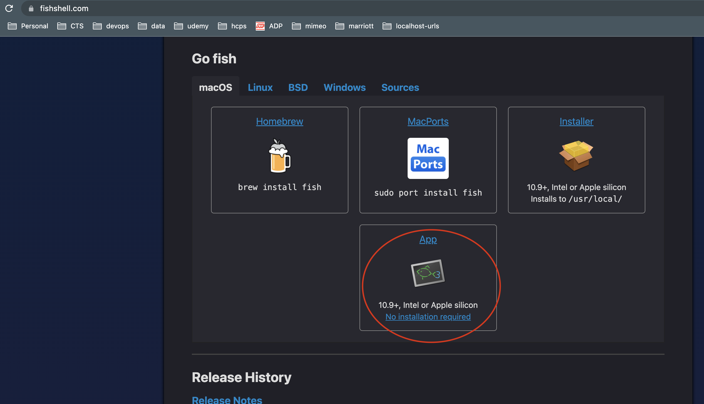
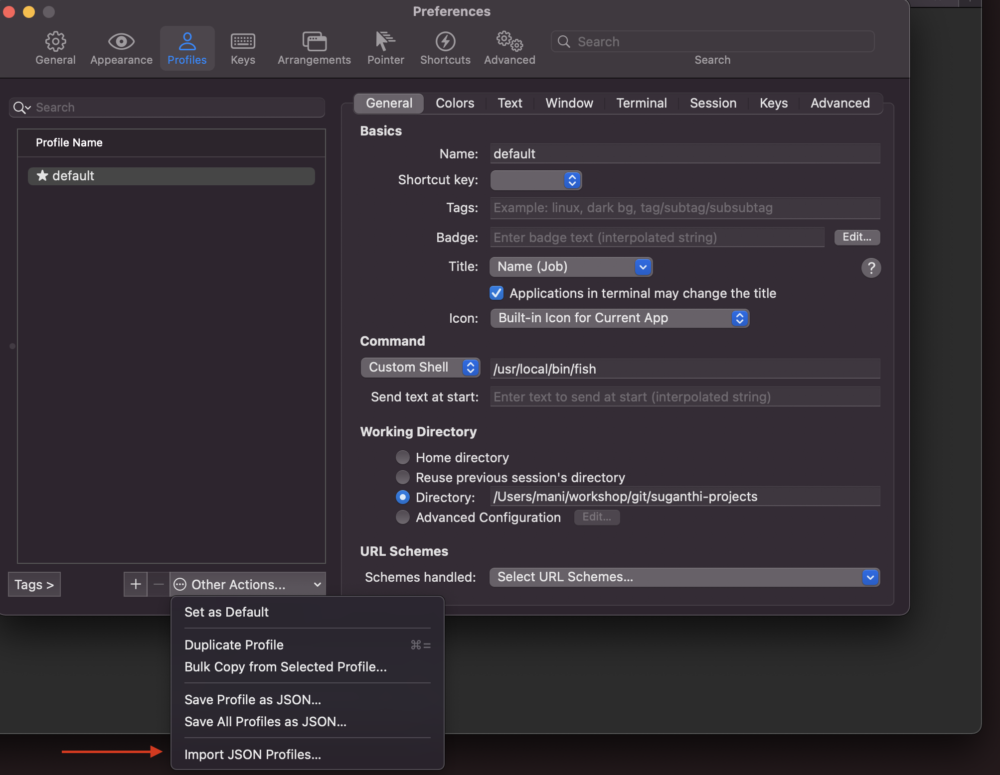
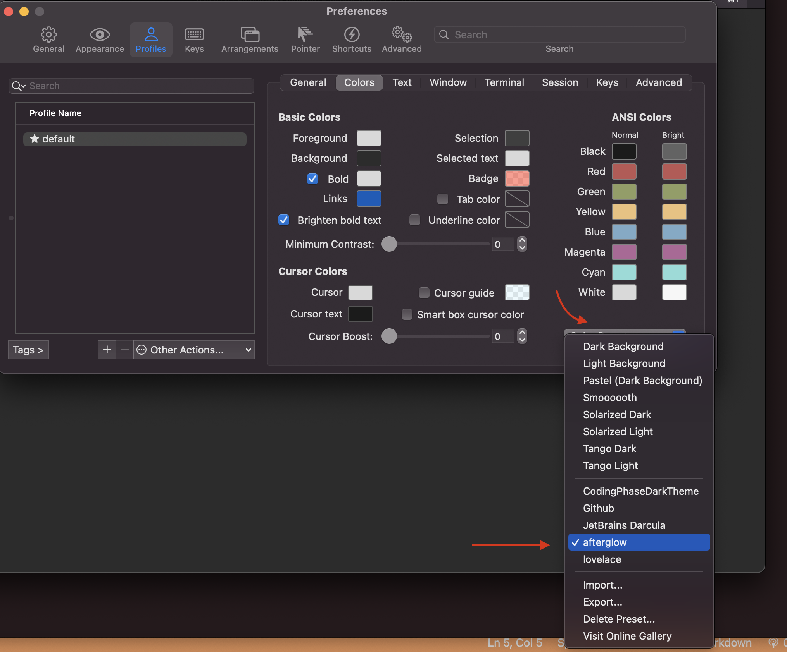
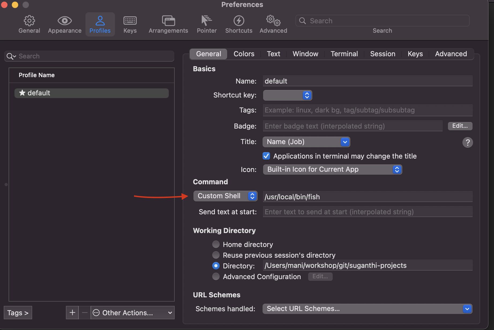
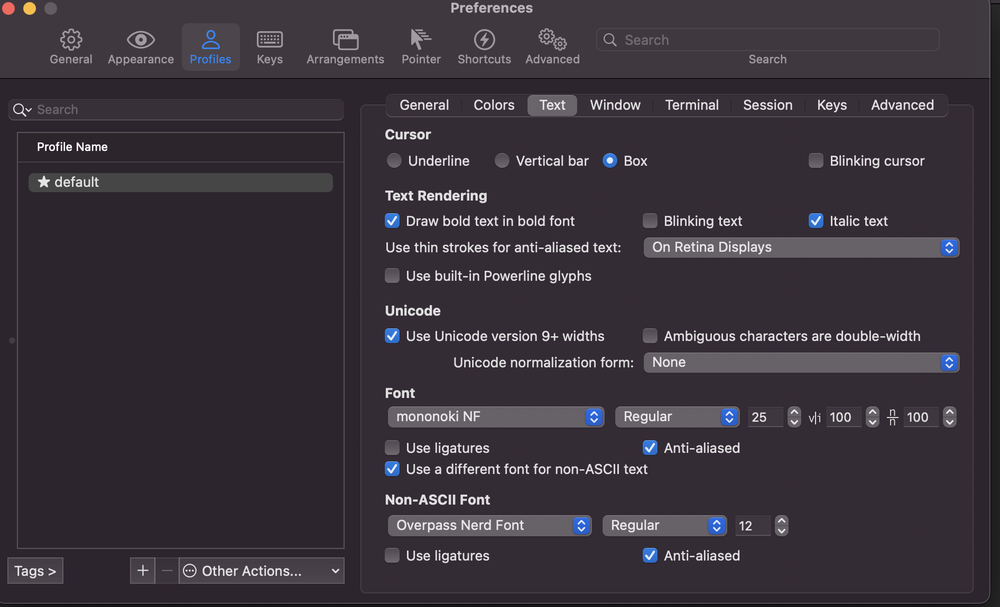

# Install iterm2 and fish shell and configuration setup

### Download iterm2 from [here](https://iterm2.com/downloads.html) or from your company self service portal

### Install iterm2

### Download fish shell



### Move it to Application folder and open it once

### open iterm2 and import profile file iterm_default_profile.json


### open iterm2 and import color palete afterglow_iterm_color.itermcolors


### open iterm2 and change custom shell and update the location

### open iterm2 copy the path of fish shell


### open iterm2 and change text

<br/>

### copy the below files into $HOME/.config/fish folder
```
.config/fish/config.fish
.config/fish/fish_variables
.config/fish/functions/fish_prompt.fish
```

