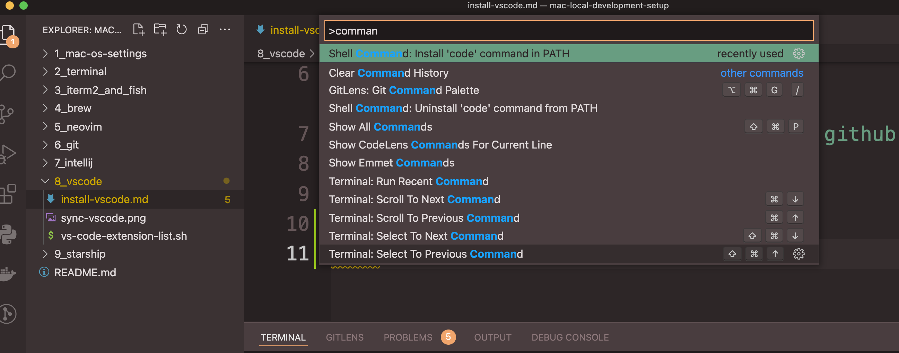

# install and config vscode

### Download vscode and install

https://code.visualstudio.com/download

### Turn on settings sync and login with github account

### install code command in path
press `cmd + shift + p` and type `command`

